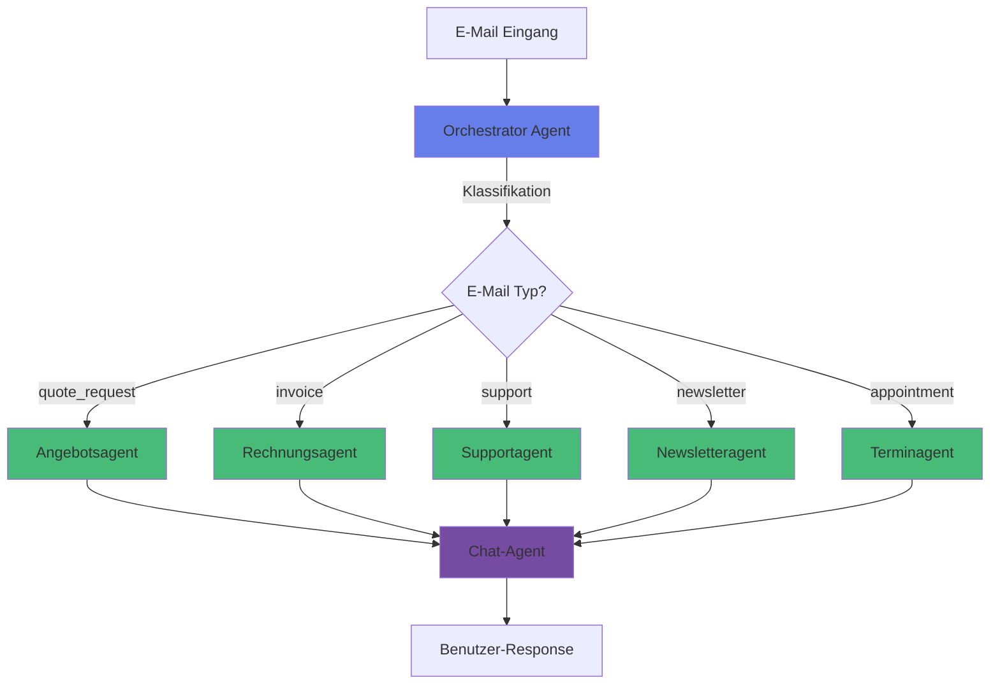
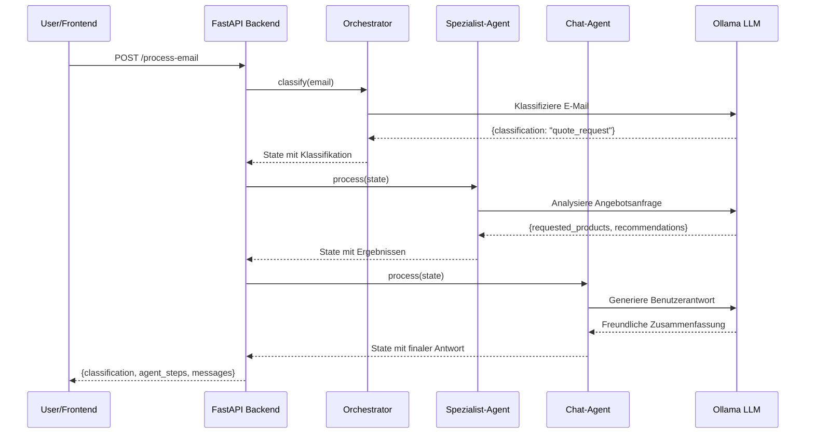

# SmartInbox Agentensystem

> Ein KI-gestütztes Multi-Agenten-System für intelligente E-Mail-Verarbeitung

Workshop-Projekt zum Thema "KI-Agentensysteme" - demonstriert Agentenarchitektur, Orchestrierung und Modellanbindung in einem praxisnahen Szenario.

## Überblick

SmartInbox ist ein vollständiges, webbasiertes Agentensystem, das eingehende E-Mails automatisch klassifiziert und an spezialisierte Agenten weiterleitet. Das System nutzt **LangGraph** für die Orchestrierung und kann mit lokalen Open-Source-Modellen (z.B. über Ollama) betrieben werden.

### Features

- **Automatische E-Mail-Klassifikation** in 5 Kategorien
- **5 spezialisierte Agenten** für unterschiedliche E-Mail-Typen
- **Interaktiver Chat-Agent** für Benutzerinteraktion
- **Visuelle Agenten-Log-Darstellung** im Frontend
- **React-basierte Web-UI** mit Echtzeit-Updates
- **Vollständig lokal lauffähig** (keine Cloud-Abhängigkeiten)

## Architektur

### System-Komponenten



### Agenten-Übersicht

| Agent | Aufgabe | Datenquellen |
|-------|---------|--------------|
| **Orchestrator** | Klassifiziert E-Mails in 5 Kategorien | E-Mail-Inhalt |
| **Angebotsagent** | Analysiert Anfragen, schlägt Produkte vor | Mock-CRM-Daten |
| **Rechnungsagent** | Prüft Rechnungen auf Vollständigkeit | E-Mail-Inhalt |
| **Supportagent** | Beantwortet Fragen via FAQ | `support_faq.json` |
| **Newsletteragent** | Extrahiert Schlagzeilen & Zusammenfassung | E-Mail-Inhalt |
| **Terminagent** | Schlägt Termine vor, fragt fehlende Infos ab | Kalender-Slots |
| **Chat-Agent** | Kommuniziert Ergebnisse an Benutzer | Alle Agentenergebnisse |

### Technologie-Stack

**Backend:**
- Python 3.11+
- FastAPI (REST API)
- LangGraph (Agenten-Orchestrierung)
- LangChain (LLM-Integration)
- Ollama (lokales LLM)

**Frontend:**
- React 18
- Vite (Build-Tool)
- Lucide Icons
- Vanilla CSS

## Installation

### Voraussetzungen

- Python 3.11 oder höher
- Node.js 18 oder höher
- Ollama (für lokales LLM)
- Git

### 1. Repository klonen

```bash
git clone <repository-url>
cd smartinbox
```

### 2. Backend einrichten

```bash
cd backend

# Virtual Environment erstellen (empfohlen)
python -m venv venv

# Virtual Environment aktivieren
# Windows:
venv\Scripts\activate
# Linux/Mac:
source venv/bin/activate

# Dependencies installieren
pip install -r requirements.txt

# .env-Datei erstellen
cp .env.example .env

# .env anpassen (optional)
# Standardmäßig verwendet das System Ollama auf localhost:11434
```

### 3. Ollama installieren und Modell laden

```bash
# Ollama installieren (siehe https://ollama.ai)
# Dann ein Modell herunterladen:

ollama pull llama2:13b

# Alternativ andere Modelle:
# ollama pull mistral
# ollama pull llama2:7b (schneller, weniger genau)
```

### 4. Frontend einrichten

```bash
cd ../frontend

# Dependencies installieren
npm install

# Optional: .env für Frontend erstellen
# echo "VITE_API_URL=http://localhost:8000/api" > .env
```

## Verwendung

### System starten

**Terminal 1 - Backend:**
```bash
cd backend
source venv/bin/activate  # bzw. venv\Scripts\activate auf Windows
python main.py
```

Das Backend läuft auf: `http://localhost:8000`
API-Dokumentation: `http://localhost:8000/docs`

**Terminal 2 - Frontend:**
```bash
cd frontend
npm run dev
```

Das Frontend läuft auf: `http://localhost:5173`

### Demo durchführen

1. Öffnen Sie `http://localhost:5173` im Browser
2. Verwenden Sie eine der vorausgefüllten Beispiel-E-Mails:
   - **Angebotsanfrage** - zeigt CRM-Integration
   - **Rechnung** - demonstriert Validierung
   - **Support** - nutzt FAQ-Datenbank
   - **Newsletter** - extrahiert Schlagzeilen
   - **Termin** - schlägt Zeitfenster vor

3. Beobachten Sie:
   - **E-Mail-Klassifikation** (Orchestrator)
   - **Agenten-Aktivität** im Log (rechts)
   - **Chat-Antwort** des Systems

4. Testen Sie die **Chat-Interaktion**:
   - Beantworten Sie Rückfragen des Systems
   - Stellen Sie Zusatzfragen

## Projektstruktur

```
smartinbox/
├── backend/
│   ├── agents/              # Agenten-Implementierungen
│   │   ├── orchestrator.py  # E-Mail-Klassifikation
│   │   ├── quote_agent.py   # Angebotsagent
│   │   ├── invoice_agent.py # Rechnungsagent
│   │   ├── support_agent.py # Supportagent
│   │   ├── newsletter_agent.py # Newsletteragent
│   │   ├── appointment_agent.py # Terminagent
│   │   ├── chat_agent.py    # Chat-Assistent
│   │   ├── state.py         # State-Definitionen
│   │   └── workflow.py      # LangGraph Workflow
│   ├── api/                 # FastAPI Routes
│   │   └── routes.py
│   ├── config/              # Konfiguration
│   │   └── settings.py
│   ├── utils/               # Hilfsfunktionen
│   │   └── llm.py          # LLM-Client
│   ├── main.py              # Backend-Einstiegspunkt
│   └── requirements.txt     # Python-Dependencies
├── frontend/
│   ├── src/
│   │   ├── components/      # React-Komponenten
│   │   │   ├── MailInbox.jsx      # E-Mail-Eingabe
│   │   │   ├── ChatInterface.jsx  # Chat-UI
│   │   │   └── AgentLog.jsx       # Agenten-Log
│   │   ├── services/        # API-Client
│   │   │   └── api.js
│   │   ├── App.jsx          # Hauptkomponente
│   │   ├── App.css          # Styling
│   │   └── main.jsx         # React-Einstiegspunkt
│   ├── package.json
│   └── vite.config.js
├── prompts/                 # Prompt-Templates
│   ├── orchestrator.txt
│   ├── quote.txt
│   ├── invoice.txt
│   ├── support.txt
│   ├── newsletter.txt
│   ├── appointment.txt
│   └── chat.txt
├── data/
│   ├── mails/               # Beispiel-E-Mails
│   │   └── example_mails.json
│   └── faq/                 # FAQ-Datenbank
│       └── support_faq.json
└── README.md
```

## Workflow-Ablauf

### Detaillierter Ablauf einer E-Mail-Verarbeitung



## Anpassung & Erweiterung

### Neue Agenten hinzufügen

1. **Agent-Klasse erstellen** in `backend/agents/`:
```python
class MyNewAgent:
    def __init__(self, prompts: dict):
        self.system_prompt = prompts.get("mynew", "...")

    def process(self, state: SmartInboxState) -> SmartInboxState:
        # Agent-Logik
        return state
```

2. **Workflow erweitern** in `workflow.py`:
```python
workflow.add_node("mynew_agent", self._route_to_mynew_agent)
```

3. **Prompt-Template erstellen**: `prompts/mynew.txt`

### Prompts anpassen

Alle Prompts befinden sich in `prompts/`. Passen Sie diese an Ihre Anforderungen an:

```bash
prompts/
├── orchestrator.txt  # Klassifikationslogik
├── quote.txt         # Angebotsverhalten
└── ...
```

### Andere LLMs verwenden

**OpenAI/Claude:**
```python
# In utils/llm.py:
from langchain_openai import ChatOpenAI

self.llm = ChatOpenAI(model="gpt-4")
```

**Andere lokale Modelle:**
```bash
# Modell in Ollama laden:
ollama pull mistral
ollama pull codellama

# In .env anpassen:
OLLAMA_MODEL=mistral
```

## Troubleshooting

### Backend startet nicht

```bash
# Prüfen Sie die Python-Version:
python --version  # Muss >= 3.11 sein

# Dependencies neu installieren:
pip install --upgrade -r requirements.txt
```

### Ollama-Verbindung fehlgeschlagen

```bash
# Prüfen Sie, ob Ollama läuft:
curl http://localhost:11434/api/tags

# Ollama neu starten:
ollama serve
```

### Frontend lädt nicht

```bash
# Node-Module neu installieren:
rm -rf node_modules package-lock.json
npm install

# Port bereits belegt? Port ändern:
# In vite.config.js: server: { port: 5174 }
```

### LLM antwortet nicht im JSON-Format

- Verwenden Sie ein stärkeres Modell (z.B. `llama2:13b` statt `llama2:7b`)
- Passen Sie die Prompts an und geben Sie mehr Beispiele
- Erhöhen Sie die `temperature` in `utils/llm.py` (für mehr Kreativität) oder senken Sie sie (für mehr Konsistenz)

## Workshop-Szenarien

### Szenario 1: Vollständiger Workflow
1. Senden Sie die Beispiel-Angebotsanfrage
2. Beobachten Sie die Klassifikation
3. Sehen Sie, wie der Angebotsagent CRM-Daten nutzt
4. Interagieren Sie mit dem Chat-Agenten

### Szenario 2: Fehlende Informationen
1. Erstellen Sie eine unvollständige Terminanfrage
2. Beobachten Sie, wie der Agent fehlende Infos identifiziert
3. Beantworten Sie die Rückfragen im Chat

### Szenario 3: FAQ-Nutzung
1. Senden Sie eine Support-Anfrage zum Thema "Login-Problem"
2. Sehen Sie, wie der Agent die FAQ durchsucht
3. Erhalten Sie eine strukturierte Antwort

## Lizenz

Dieses Projekt ist für Bildungszwecke konzipiert.

## Kontakt & Support

Bei Fragen zum Workshop oder technischen Problemen:
- Erstellen Sie ein Issue im Repository
- Kontaktieren Sie den Workshop-Leiter

---

**Viel Erfolg beim Workshop!** 🚀
